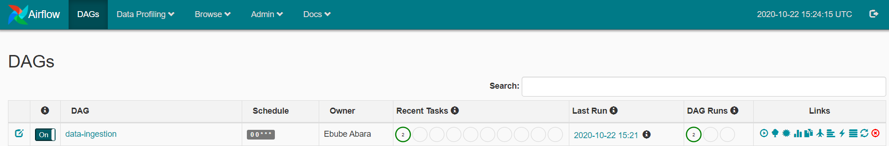
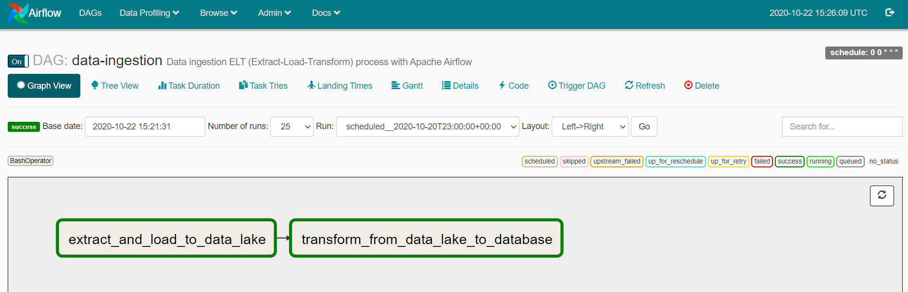
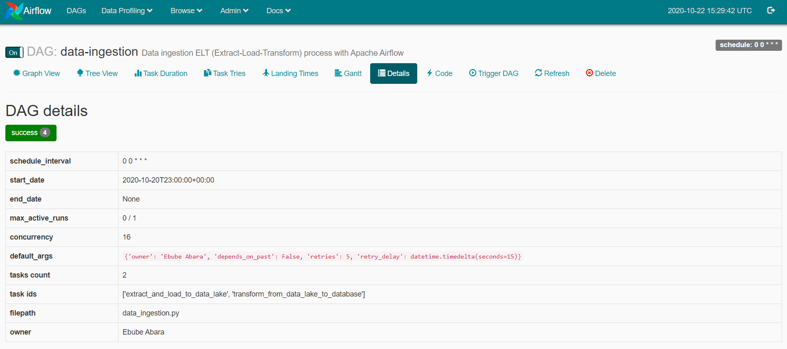
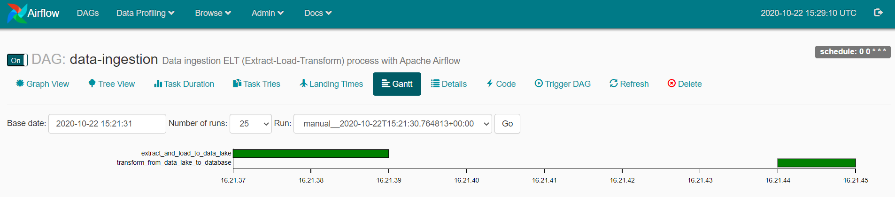
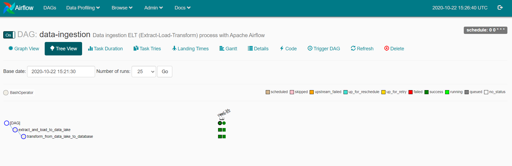
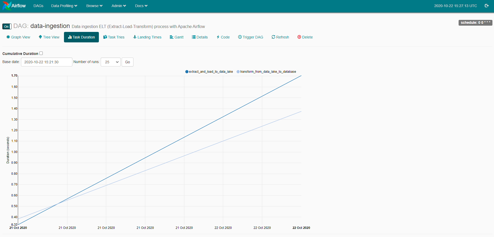
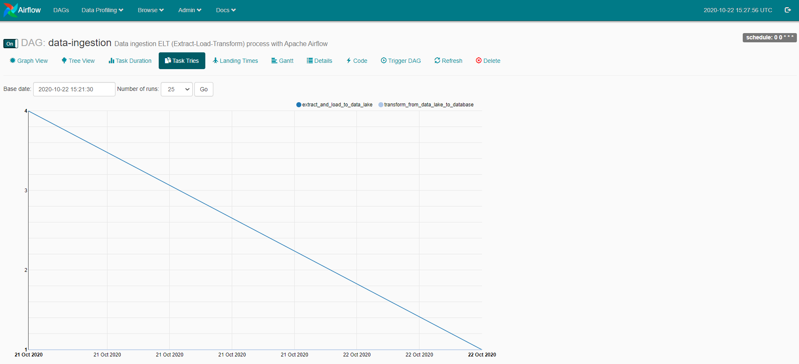
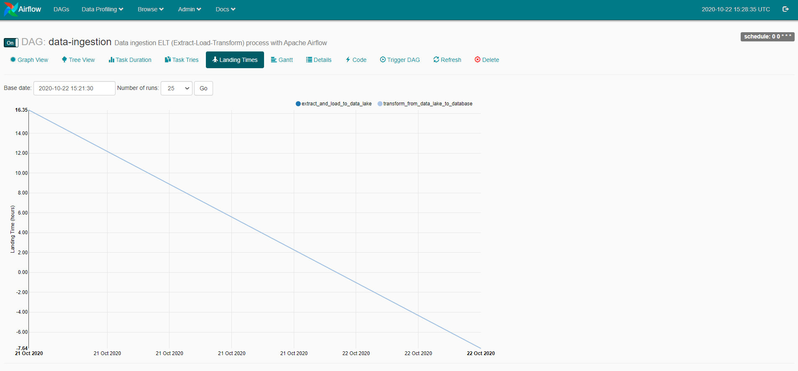
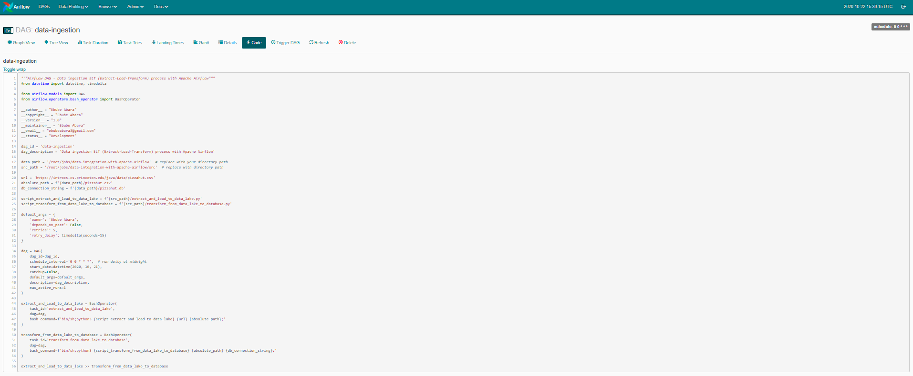

# Data integration with Apache Airflow

In this example, we will be using an [Apache Airflow](https://airflow.apache.org/) DAG to orchestrate the data 
ingestion (ELT) process for the latitude and longitude of Pizza Huts in North America.

It uses open source data provided by [Princeton University](https://introcs.cs.princeton.edu/java/data/).
Apache Airflow is an open source workflow management and orchestration platform created in October 2014 
by engineers at Airbnb. It enables developers and data engineers to programmatically author, schedule, log, monitor and 
troubleshoot their DAG workflows using Python. A DAG (Direct Acyclic Graph) is a collection of runnable tasks organised 
in a way that reflects their relationships and dependencies

### Pizza Hut Location data ingestion process

| Resource                                              | Details                                     |
|------------------------------------------------------ | ------------------------------------------- |
| pizzahut.csv                                          | Source file                                 |
| pizzahut.db                                           | SQLite Database                             |
| `/dags/data_ingestion.py`                             | Airflow DAG script                          |
| `/src/extract_and_load_to_data_lake.py`               | Extract and load to data lake script        |
| `/src/transform/from/data_lake_to_database.py`        | Transform from data lake to database script |
| `/src/utils/connection.py` and `/src/utils/logger.py` | Helper scripts                              |
| `/src/utils/sqlite_create_table_branch_location.sql`  | Create database table script                |
| `requirements.txt`                                    | Software packages requirements file         |

### Prerequisite:

* Install and configure Apache Airflow on Ubuntu Server (or your server of choice)
    * Read this [article](https://github.com/ebubeabara/install-and-configure-apache-airflow-on-ubuntu-server) for how to setup Airflow on Ubuntu
* Python 3.6 or greater [download and install here](https://www.python.org/downloads/)
* SQLite [download and install here](https://www.sqlitetutorial.net/download-install-sqlite/)

### Other useful Airflow views

by **Ebube Abara**
